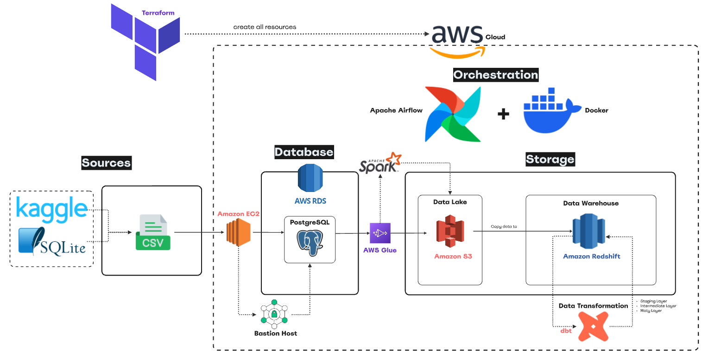
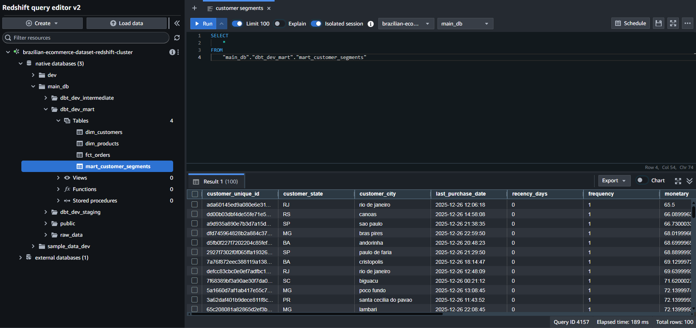

# Brazilian E-Commerce Data Pipeline with AWS


## Project Overview
This project demonstrates an End-to-End (ELT) Data Pipeline designed to simulate the migration and analysis of **[E-commerce dataset](https://www.kaggle.com/datasets/terencicp/e-commerce-dataset-by-olist-as-an-sqlite-database)** using a Modern Data Stack entirely on AWS Cloud.

The primary goal is to extract raw transactional data from an Operational Database (PostgreSQL), load it as a raw data into a Data Lake (S3) and Data Warehouse (Redshift), and transform it into analytical Data Models by using DBT make it ready for Business Intelligence use cases.



## Architecture & Tech Stack

**Cloud Provider**: **[AWS](https://aws.amazon.com/free/?trk=54026797-7540-48d8-9f6b-0db2c3a0040c&sc_channel=ps&trk=54026797-7540-48d8-9f6b-0db2c3a0040c&sc_channel=ps&ef_id=CjwKCAiAu67KBhAkEiwAY0jAlam1eDunR-LupK-0oHaEMUnbRCgf57LcGzPNrDpYRvJho7v1h2cxrhoCFmcQAvD_BwE:G:s&s_kwcid=AL!4422!3!785574063527!e!!g!!aws&gad_campaignid=23291338728&gbraid=0AAAAADjHtp_Tc6J3vDUByb2zRyxBIY_KU)**

**Infrastructure as Code (IaC):  [Terraform](https://developer.hashicorp.com/terraform)**: Used for provisioning and managing all AWS resources (VPC, RDS, Redshift, S3, IAM, EC2) as code.

**Compute & Processing:**

- Extraction (Ingestion): **[AWS Glue](https://aws.amazon.com/glue/)** (Serverless Spark) for scalable data extraction from RDS to S3.

- Transformation: **[dbt (Data Build Tool)](https://www.getdbt.com/)** for performing data transformation, testing, and data modeling directly within the data warehouse.

- Bastion Host: **[Amazon EC2](https://aws.amazon.com/ec2/?trk=23d37cb6-5ff5-432b-8f98-819faa211372&sc_channel=ps&trk=23d37cb6-5ff5-432b-8f98-819faa211372&sc_channel=ps&ef_id=CjwKCAiAu67KBhAkEiwAY0jAlU2IS4ou8DJz5lee674k1bybSTwaWtbxKw7lG5PZ7F8rq7MbcG7SjhoCFCcQAvD_BwE:G:s&s_kwcid=AL!4422!3!785483253502!e!!g!!amazon%20ec2&gad_campaignid=23300619073&gbraid=0AAAAADjHtp9uZ-Iv-szCBIfnzXY8ALy3m)** used as a secure jump server to access and manage the private RDS instance and other internal resources.

**Data Sources & Storage:**

- Operational Database: **[PostgreSQL](https://www.postgresql.org/) [AWS RDS](https://aws.amazon.com/free/database/?trk=2a51c845-165e-4c5f-98c5-d87cf2e63c5f&sc_channel=ps&trk=2a51c845-165e-4c5f-98c5-d87cf2e63c5f&sc_channel=ps&ef_id=CjwKCAiAu67KBhAkEiwAY0jAlZW6-FW-pN8xUm1DPpo803FqMlJ18iiIQ3-MVR8yoRe2kyCcAX3wlhoCw8IQAvD_BwE:G:s&s_kwcid=AL!4422!3!785574075731!e!!g!!aws%20rds&gad_campaignid=23291337525&gbraid=0AAAAADjHtp8rcm1N8A1hQHUslVw50yZqx)** serving as the source of transactional e-commerce data.

- Data Lake: **[Amazon S3](https://aws.amazon.com/s3/?trk=3d8e0834-4a13-43d9-9142-a95c86f6929f&sc_channel=ps&trk=3d8e0834-4a13-43d9-9142-a95c86f6929f&sc_channel=ps&ef_id=CjwKCAiAu67KBhAkEiwAY0jAlRa03HuhZOvvCsSM1GMQo4EyrDVhhxvf0PtfLd7Lv3EeIRVVhri41hoCEQMQAvD_BwE:G:s&s_kwcid=AL!4422!3!785447140458!e!!g!!amazon%20s3&gad_campaignid=23291342325&gbraid=0AAAAADjHtp8s_pxuL2Z45Cz478L-1Fkhe)** for cost-effective storage of raw data in Parquet format with Hive-style partitioning.

- Data Warehouse: **[Amazon Redshift](https://aws.amazon.com/th/redshift/)** for high-performance data warehousing and analytics.

**Orchestration: [Apache Airflow](https://airflow.apache.org/docs/apache-airflow/stable/howto/docker-compose/index.html)** running on **[Docker](https://www.docker.com/)** containers to schedule and monitor the entire workflow and manage dependencies between tasks.

**Languages:** **[Python](https://www.python.org/), [SQL](https://www.w3schools.com/sql/)**

## Key Features

- Fully Automated Infrastructure: The entire environment can be provisioned and destroyed with a single Terraform command `terraform apply` & `terraform destroy`, ensuring reproducibility.

- Serverless Extraction: Utilizes **AWS Glue Jobs** for scalable, serverless data extraction supporting Incremental Loads.

- Dynamic Loading: Includes a custom Python script using pyarrow to dynamically detect Parquet schemas and generate CREATE TABLE statements for Redshift, solving schema evolution issues.

- Quality Assurance: Integrates `dbt test` to validate data integrity (Unique, Not Null, Referential Integrity) in every run.

- Secure Access: Implements a **Bastion Host** architecture for secure administrative access to private database instances.

## Pipeline Flow

1. Extract data from RDS using AWS Glue based on the execution date, trigger by Airflow.

2. Load raw data and write in Parquet format with partitioned by date (`year=/month=/date=`) to S3.

3. Copy raw data from S3 into Redshift in raw zone, trigger by Airflow.

4. Transform, clean, and create data model (Staging Layer, Intermetiate Layer, and Mart Layer) by dbt.

5. Test by running dbt test cases to ensure data quality.

## Data Simulation & Initial Setup (Manual Step)
To simulate a real-world scenario where an application generates transactional data, we first need to seed our Operational Database **(RDS PostgreSQL)** with historical data.

Source Data: We use the **[Brazilian E-Commerce Public Dataset by Olist]((https://www.kaggle.com/datasets/terencicp/e-commerce-dataset-by-olist-as-an-sqlite-database))** (SQLite format).

**Step-by-Step Data Seeding:**
1. Prepare Data:
    - Download the `olist.sqlite` file and place it in the `csv_data/` folder.
    - Install project dependencies using Poetry:

    ```
    pip install poetry
    poetry install
    ```

    - Run the conversion script to extract tables from SQLite to CSV format:

    ```
    poetry run python3 rds/export_sqlite.py
    ```
    - After run this command, you should get 11 files of `.csv` and 1 of `.sql` file.
    - Next step, run the date transformation script to shift historical dates to the current timeframe, simulating recent transactions:

    ```
    poetry run python3 rds/date_transform.py
    ```

2. Provision Infrastructure:
    - Initialize and apply Terraform to create all AWS resources.
    
    ```
    cd terraform
    terraform init
    terraform apply --auto-approve
    ```

3. Secure Access via Bastion Host:
    - Since the RDS instance is in a Private Subnet, we use the Bastion Host (EC2) in the Public Subnet as a jump server.
    - Copy the CSV files and the private key `.pem` to the Bastion Host using scp:

    ```
    cd rds
    scp -i credentials/data-pipeline-key.pem -r csv_data ec2-user@BASTION_IP:/home/ec2-user/
    ```

    - Then SSH into the Bastion Host:

    ```
    ssh -i credentials/data-pipeline-key.pem ec2-user@BASTION_IP
    ```

4. Load Data into RDS:
    - Inside the Bastion Host, install the PostgreSQL client:

    ```
    sudo amazon-linux-extras enable postgresql14
    sudo yum install postgresql -y
    ```

    - Then connect to PostgreSQL:

    ```
    psql -h [RDS_ENDPOINT] -U [DB_USERNAME] -d main_db
    ```

    - After jump into the Database, create schema and copy our csv file into PostgreSQL:

    ```
    \i /home/ec2-user/csv_data/schema.sql

    \copy customers FROM '/home/ec2-user/csv_data/customers.csv' CSV HEADER;
    \copy geolocation FROM '/home/ec2-user/csv_data/geolocation.csv' CSV HEADER;
    \copy leads_closed FROM '/home/ec2-user/csv_data/leads_closed.csv' CSV HEADER;
    \copy leads_qualified FROM '/home/ec2-user/csv_data/leads_qualified.csv' CSV HEADER;
    \copy order_items FROM '/home/ec2-user/csv_data/order_items.csv' CSV HEADER;
    \copy order_payments FROM '/home/ec2-user/csv_data/order_payments.csv' CSV HEADER;
    \copy order_reviews FROM '/home/ec2-user/csv_data/order_reviews.csv' CSV HEADER;
    \copy orders FROM '/home/ec2-user/csv_data/orders.csv' CSV HEADER;
    \copy product_category_name_translation FROM '/home/ec2-user/csv_data/product_category_name_translation.csv' CSV HEADER;
    \copy products FROM '/home/ec2-user/csv_data/products.csv' CSV HEADER;
    \copy sellers FROM '/home/ec2-user/csv_data/sellers.csv' CSV HEADER;
    ```

    *The RDS database is now populated with transactional data, ready for the Airflow pipeline to extract.*

## Run the Pipeline
### Prerequisites
- AWS Account & CLI Configured

- Docker & Docker Compose

- Terraform

- Python 3.12+

### Configuration Setup
This project uses environment variables and Terraform variables for configuration.
1. **Terraform:**
    - Create `terraform.tfvars` file in the `terraform/` directory.

    ```
    cd terraform
    touch terraform.tfvars
    ```

    - Use `terraform.tfvars.example` as a template and replace the placeholder values (e.g. `YOUR-PROJECT-NAME`) with your own configuration.

2. **Airflow & Scripts:**
    - Create `.env` file in the `dags/` directory.

    ```
    cd airflow/dags
    touch .env
    ```

    - Use `.env.example` as a template and replace the placeholder values (e.g. `YOUR_DBT_HOST`) with your own configuration.

3. **AWS Glue Job Setup (Manual Step):**

    Since we opted out of managing the Glue Job via Terraform for simplicity in this project, you need to create it manually in the AWS Console.
    - **Create Connection:** Go to `AWS Glue` > `Data connections` and `Create Connection`. In Data sources, select `Network` then choose your VPC, Private Subnet (A) and, Security groups (only Glue) and names your network.
     
     - **Create Job:** Go to `ETL Jobs` > `Create job from a black graph` > `Job details`. And put the values following this:
        - `Name`: `rds_to_s3_load_job` (Must match GLUE_JOB_NAME in .env)

        - `IAM Role`: Select the role created by Terraform (e.g., glue-role)

        - `Type`: Spark

        - `Worker` Type: `G.1X` (2 Workers for cost effectiveness)

        - `Script Path`: Select the uploaded script in S3 (`s3://[YOUR_S3]/glue-scripts/`)

        - `Connections`: Select the connection created above.

        - `Job Parameters`: Add the following default keys (values can be dummy defaults as Airflow will override them):
            1.  `--S3_OUTPUT_PATH`: `s3://[YOUR_S3]/`

            2. `--RDS_ENDPOINT`: `YOUR_RDS_ENDPOINT`

            3. `--DB_NAME`: `YOUR_DB_NAME`

            4. `--DB_USERNAME`: `YOUR_DB_USERNAME`

            5. `--DB_PASSWORD`: `YOUR_DB_PASSWORD`

### Run Airflow
1. **Start Airflow:**
    ```
    cd airflow
    docker-compose up -d
    ```

2. **Trigger DAG:**
    - Login to Airflow UI (`localhost:8080`)
        - Username: `airflow`
        - Password: `airflow`

    - Trigger the `full_elt_pipeline` DAG.

### Final Result



*Don't forget to run `terraform destroy` after finishing the project to destroy all resources to avoid incurring charges.*

## Project Potential Enhancements for Production
While this project successfully demonstrates a functional end-to-end pipeline, the following enhancements are recommended for a production-grade deployment:

1. **Fully Automated Glue Deployment (IaC):**
    Integrate the AWS Glue Job and Connection resources directly into the Terraform configuration `(aws_glue_job`, `aws_glue_connection`) to achieve 100% Infrastructure as Code automation, removing manual setup steps.

2. **Data Quality Monitoring & Alerting:**
    Integrate monitoring tools like **Amazon CloudWatch** or **Great Expectations** to set up alerts for pipeline failures or data quality anomalies.

3. **Production-Grade Airflow Deployment:**
    Deploy Airflow on a secure **EC2** instance (within a **Private Subnet**) or utilize **Amazon MWAA** (Managed Workflows for Apache Airflow) instead of running locally via Docker Compose. This enhances security by keeping the orchestrator inside the VPC.
